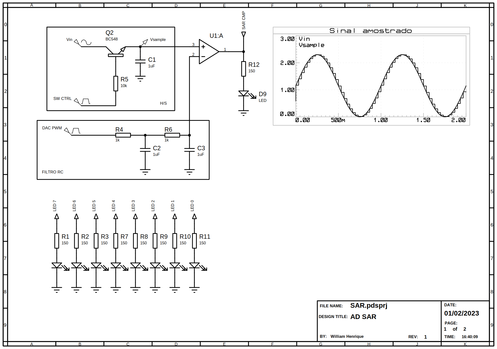

# Projeto de Conversor Analógico digital por aproximação sucessiva

Este repositório contêm o protótipo de um conversor AD SAR (Successive approximation register) 8 Bits com lógica digital emulado por microcontrolador. Um NUCLEO-F401RE foi utilizado para emular um registro de 8 bits. Também, para fornercer sinais de controle para o Holding/Sample (H/S) e um sinal PWM para a conversão de sinais digitais para analógico a partir do processo de filtragem do sinal, o valor de tensão na saída é regulado pelo duty cicle.

Um registrador de aproximação sucessiva (Sucessive Aproxximation Register - SAR, simulado pelo umpu) é inicializado com uma palavra binária que representará o valor lido de `Vin` ao fim do processo de conversão. Em seguida, o palpite digital é convertido para uma grandeza analógica que será utilizado como referência na entrada inversora do comparador `U1`, o processo do conversor digital-analógico (DAC) é controlado pelo ciclo de trabalho do sinal PWM `DAC PWM` de modo que na saída do filtro RC temos o resultado da conversão. 

O `SW CTRL` é reponsável por chavear o circuito por um determinado intervalo de tempo, o valor amostrado é armazenado em um capacitor e comparado com o palpite inicializado no SAR. Assim, o sinal amostrado é levado a entrada não-inversora do comparador `U1`. Então, o comparador apresentará uma saída (`SAR CMP`) em nível alto no caso do valor tensão do sinal amostrado ser maior do que o valor de tensão gerado pelo palpite do DAC, e um saída em nível baixo caso contrário.

Se o resultado da operação no comparador for verdadeira (nível lógico alto) é mantido um bit '1' no índice corrente do SAR, caso contrário um bit '0' é adicionado na posição do índice. Em seguida, o índice vai para o proximo bit da palavra e define como '1' e então faz a conversão do novo palpite por meio do DAC, o valor na convertido é comparado com o valor armazenado no capacitor, a depender do resultado da operação no comparador o palpite é mantido ou descartado e depois uma nova iteração ocorre até que todos os índices da palavra de 8 bits sejam percorridos. 

Os Leds do circuito (do `LED 0` ao `LED 7`) represetam os bits da palavra armazenada no SAR, e servem apenas para fornercer feedback visual dos resultados da operação.

 
  
  

*Sugestão*: Substituir o BC548 por um E-MOSFET canal n.

